# Plan Enforcer

[](LICENSE)
[](https://claude.ai/code)
[](https://nodejs.org)

**Chain-of-custody control for AI coding.**

Plan Enforcer is the control and accountability layer beneath AI-assisted implementation.

It gives drifting agent work a real ledger, a real decision trail, and a real chain of custody from original ask to landed repo state.

Keep your planner. Keep your IDE. Keep your workflow.

Plan Enforcer exists to make agent work **fidelity-preserving, accountable, and cold-reviewable**.

[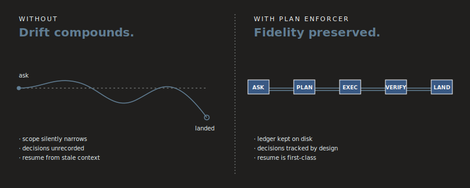](docs/proof/public-proof.md)

---

## What this makes provable

Plan Enforcer is built for the moments where AI coding usually gets slippery:

- the model quietly narrows the ask
- the plan mutates mid-flight and nobody records why
- resumed work continues from stale context
- "done" is declared before the repo actually reflects the request
- six months later nobody can explain why a file changed

Plan Enforcer makes those failure modes visible and reviewable by preserving:

- **ask fidelity** from original request to landed work
- **execution lineage** from plan to implementation to closure
- **decision traceability** when scope changes or tradeoffs are made
- **resume continuity** across interrupted or resumed sessions
- **closure truth** tied to what actually landed in the repo

This is not just prompting discipline. It is a chain-of-custody layer for AI implementation.

---

## Install in 60 seconds

```bash
git clone https://github.com/jccidc/.plan-enforcer.git
cd .plan-enforcer
./install.sh
```

**Requires [Claude Code](https://claude.ai/code) and Node.js >= 18.**

Installs Claude Code hooks and skills. Default tier is `structural`.

Start here:

- [Try it](docs/try-it.md)
- [CLI guide](docs/cli.md)
- [Examples](docs/examples/README.md)
- [Public proof](docs/proof/public-proof.md)

---

## What it is

Plan Enforcer is an enforcement and truth layer for AI coding workflows.

It does three jobs:

### 1) Capture intent before drift starts

It gives planning and authorship a formal place to live before implementation runs away from the ask.

[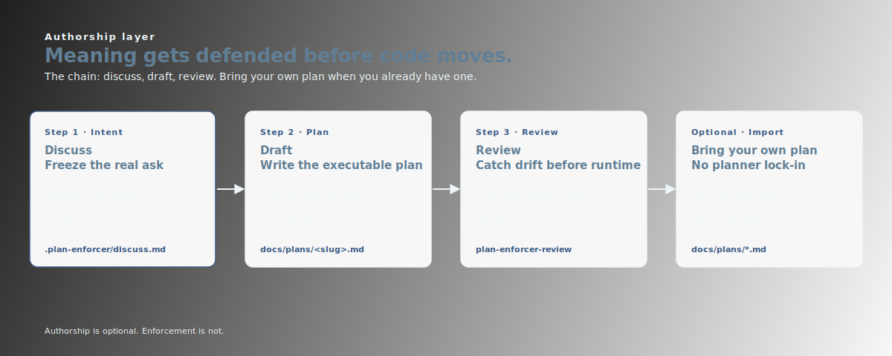](docs/assets/authorship-chain.svg)

- `discuss` captures intent, constraints, and mutation-sensitive context
- `draft` converts that into an executable plan
- `review` checks for narrowing, weak proof, and plan drift
- bring-your-own plans still run through the same enforcement and audit surface

### 2) Constrain execution while work is happening

It keeps long-running work grounded in a ledger the repo can understand later.

[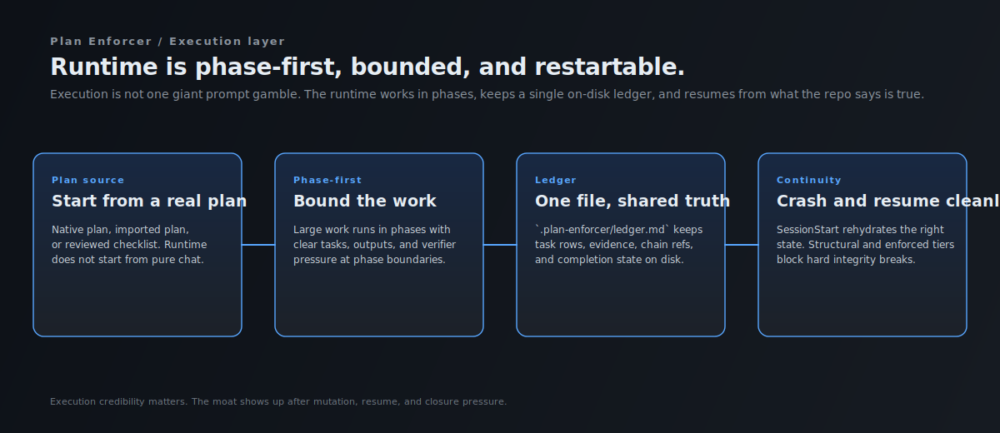](docs/assets/workflow.svg)

- large work runs phase-first instead of as one giant wish
- `.plan-enforcer/ledger.md` stays human-readable and machine-parseable
- Claude Code hooks enforce workflow boundaries where tool-call blocking exists
- structural and enforced modes let teams choose how hard the walls need to be
- crash and resume continuity are part of the runtime, not an afterthought

### 3) Preserve truth after the model is done talking

It turns final review into evidence work instead of confidence theater.

[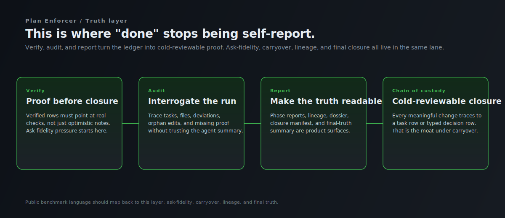](docs/assets/chain-of-custody.svg)

- verify, audit, and reporting are first-class surfaces
- ask fidelity, carryover, and closure truth live in the same proof lane
- lineage stays reconstructible from repo artifacts
- final sign-off is tied to landed work, not model narration

---

## What it catches

Plan Enforcer is strongest where AI coding becomes hardest to trust.

It is designed to catch or surface:

- silent narrowing of the original request
- phase drift and plan erosion during long execution
- undocumented scope changes
- incomplete closure masked as completion
- stale-context resumes
- missing carryover between sessions
- changes that landed without a defensible decision trail

That is the real wedge.

Not "better prompting." Not "nicer planning."

**Fidelity under mutation. Continuity under interruption. Truth under review.**

---

## Bring your own plan

Plan Enforcer is not planner lock-in.

Use the built-in flow:

- `discuss -> draft -> review -> execute -> verify`

Or bring a plan from anywhere:

- GSD
- Superpowers
- a markdown checklist
- your own planning workflow

Fast path:

```bash
plan-enforcer import docs/plans/my-plan.md
```

Same ledger.  
Same enforcement layer.  
Same audit surface.  
Same closure truth.

---

## Why believe it

The public claim is intentionally narrow:

> Plan Enforcer is strongest where agent work usually becomes unshippable: repaired-contract carryover, chain of custody, and final truth.

This repo includes a proof pack focused on those claims:

- [Benchmark summary](docs/proof/benchmark-summary.md)
- [Carryover proof](docs/proof/carryover-proof.md)
- [Composability proof](docs/proof/composability-proof.md)
- [Dogfood proof](docs/proof/dogfood-proof.md)
- [Roadmap regression proof lane](docs/proof/roadmap-regression.md)
- [Public proof frames](docs/proof/public-proof.md)

Visual proof surfaces:

[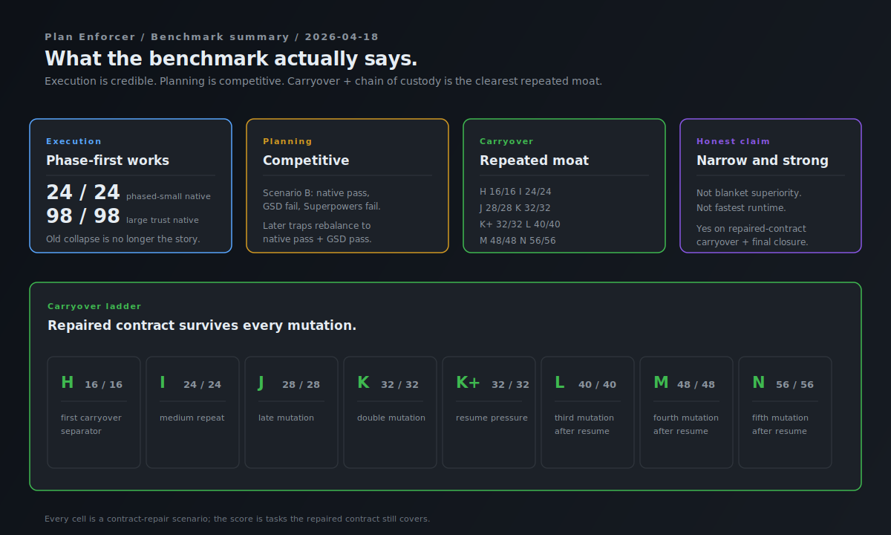](docs/proof/benchmark-summary.md)

[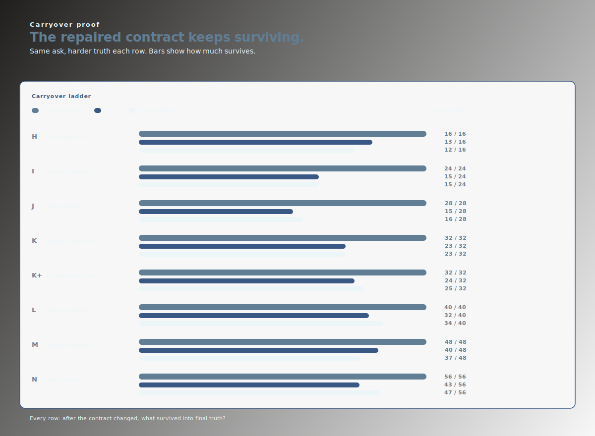](docs/proof/carryover-proof.md)

[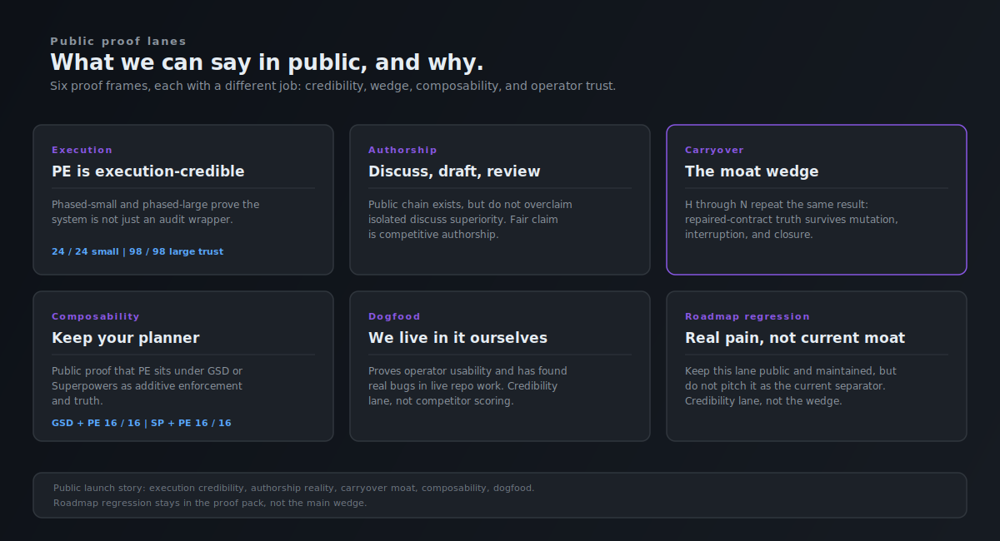](docs/proof/public-proof.md)

---

## See the whole system

[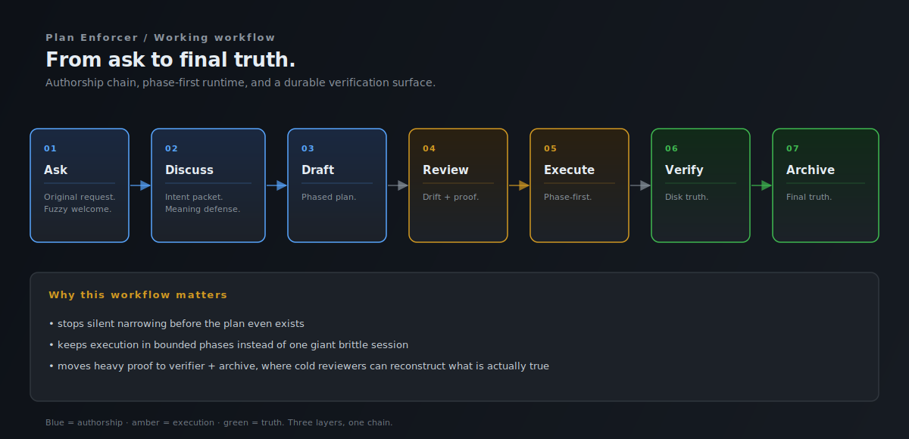](docs/assets/workflow.svg)

[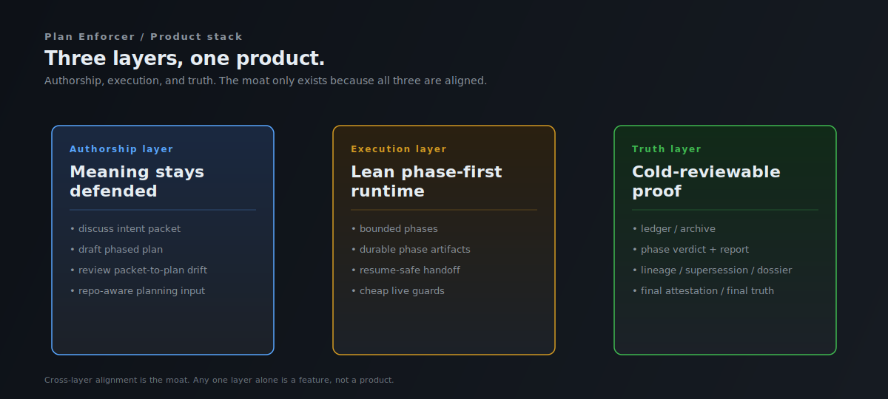](docs/assets/stack.svg)

[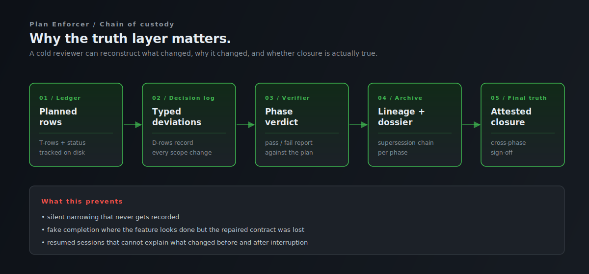](docs/assets/chain-of-custody.svg)

[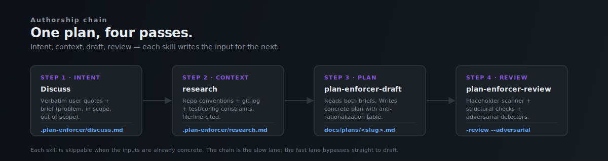](docs/assets/authorship-chain.svg)

---

## Best fit

Plan Enforcer is a strong fit for:

- long-running agent work where drift compounds over time
- regulated or auditable engineering environments
- migrations, auth, payments, infra, and other high-risk changes
- work with handoffs, resumes, and late requirement mutations
- teams that need evidence, not just output

Less suited for:

- one-shot throwaway scripting where audit does not matter
- workflows optimized purely for raw speed
- teams comfortable treating commit messages as their only explanation layer

---

## Common questions

**Is this a replacement for GSD or Superpowers?**  
No. It is an enforcement and truth layer. Use your planner of choice.

**Does it need a server?**  
No. Ledger, decision log, archive, and proof stay on disk.

**Does it only work with Claude Code?**  
Full tool-call blocking is strongest where Claude Code hooks are available. Other surfaces still benefit from the authorship, ledger, and audit model.

**What is the moat versus better prompting?**  
Prompts are guidance. Chain-of-custody enforcement is control.

**What makes this different from a checklist?**  
A checklist records intention. Plan Enforcer preserves lineage between ask, plan, execution, decisions, and closure.

---

## What we do not claim

- blanket superiority on every axis
- the cheapest runtime in every scenario
- that every workflow needs this much structure
- that planning alone is the whole problem

The claim is narrower and stronger:

> When AI implementation has to survive scrutiny, mutation, interruption, and final review, Plan Enforcer provides the chain of custody.

---

## Contributing

Open issues and PRs are welcome.

If your workflow has a real failure mode that is not represented in the proof pack yet, open an issue and describe it. The most useful contributions are not just patches. They are failure cases with receipts.

---

## License

MIT. See [LICENSE](LICENSE).
