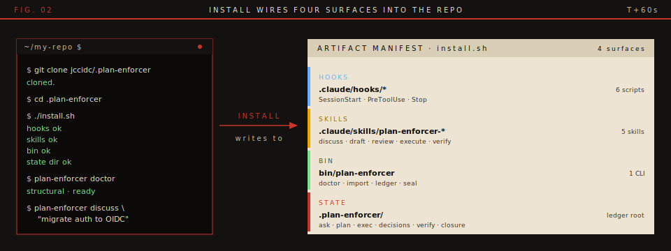
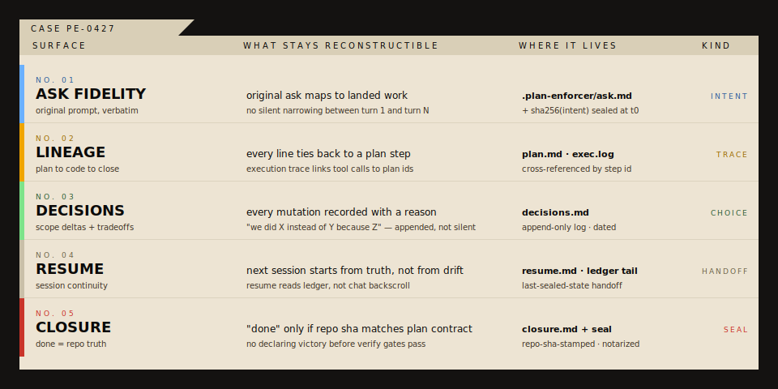
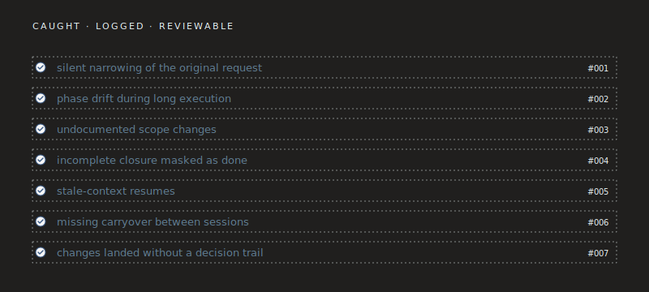
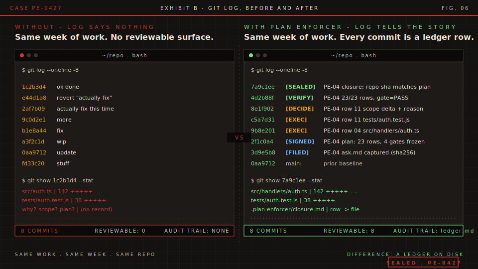
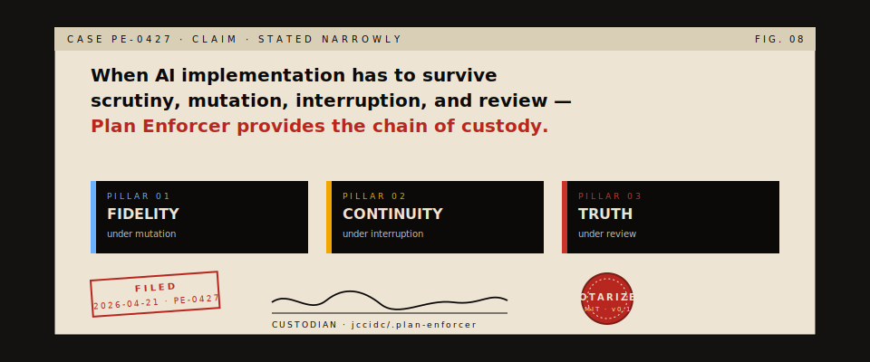

# Plan Enforcer

[](LICENSE)
[](https://claude.ai/code)
[](https://nodejs.org)

`CHAIN-OF-CUSTODY LAYER` `V0.1` `MIT`

Plan Enforcer is ledger, decision trail, and chain of custody underneath AI-assisted coding, from original ask to repo state that shipped.

`CASE No. PE-0427`  
`FILED 2026-04-21`  
`CUSTODIAN jccidc/.plan-enforcer`

[](docs/proof/public-proof.md)

> FIG. 01 — Without: four failure moments, none with receipts. With: six stages, each one a file on disk.

---

## 01 / Install

Sixty seconds. One ledger.

Requires [Claude Code](https://claude.ai/code) and [Node.js >= 18](https://nodejs.org). Installs hooks and skills. Default tier: `structural`.

```bash
git clone https://github.com/jccidc/.plan-enforcer.git
cd .plan-enforcer
./install.sh
plan-enforcer doctor
plan-enforcer discuss "..."
```

If `doctor` reports missing project config, that is onboarding state, not broken install. First `discuss` or `import` bootstraps repo-local `.plan-enforcer/` state.



> FIG. 02 — `install.sh` wires exactly four surfaces. Nothing hidden, nothing outside the repo.

| Without | With Plan Enforcer |
| --- | --- |
| scope silently narrows | `ask -> plan -> exec -> verify -> land` |
| decisions go unrecorded | ledger kept on disk |
| resumes start from stale context | resume continuity is first-class |

---

## 02 / What This Makes Provable

Plan Enforcer is built for moments where AI coding gets slippery: ask narrowing, mid-flight plan mutation, stale-context resumes, and "done" declared before repo truth catches up.

Those failure modes stop being invisible. Each one has a file you can open.



> FIG. 03 — Five surfaces, five files. Every one readable, replayable, reviewable.

---

## 03 / Three Layers. One Custody Chain.

`ASK -> PLAN -> EXEC -> DECIDE -> VERIFY -> LAND`


> FIG. 04 — Each layer owns a guarantee. Each guarantee lives in named files. One chain links them.

---

## 04 / What It Catches

These are the failure modes the ledger is built to surface and preserve. Each one has a before-state and a caught-state. Each caught-state is a real file path.



> FIG. 05 — Four failure modes, four tiles, four receipts.



> FIG. 06 — Same work, same week, same repo. The difference is a ledger on disk.

---

## 05 / Bring Your Own Plan

Not planner lock-in.

Front door:
`discuss -> draft -> review -> execute -> verify`


```bash
plan-enforcer import docs/plans/my-plan.md
```


> FIG. 07 — Whatever plan format you bring, the ledger entry has one shape. That shape is what gets audited.


Proof pack:
- [Public proof map](docs/proof/public-proof.md)
- [Proof pack index](docs/proof/README.md)
- [Benchmark summary](docs/proof/benchmark-summary.md)
- [Carryover proof](docs/proof/carryover-proof.md)
- [Composability proof](docs/proof/composability-proof.md)
- [Dogfood proof](docs/proof/dogfood-proof.md)
- [Roadmap regression](docs/proof/roadmap-regression.md)

Visual proof surfaces:
- [Benchmark summary chart](docs/assets/benchmark-summary.svg)
- [Carryover ladder](docs/assets/carryover-ladder.svg)
- [Proof lanes](docs/assets/proof-lanes.svg)

---

## 06 / Best Fit

Scored on five dimensions: duration, risk, auditability, handoff, evidence need. If most bars stay empty, Plan Enforcer is overhead you don't need. If they fill, you are already paying the cost of custody elsewhere.


> FIG. 08 — Empty bars: you don't need a custody layer. Full bars: you already need one.

Strong fit:
- long-running agent work where drift compounds over time
- regulated or auditable engineering
- migrations, auth, payments, infra, and other high-risk changes
- work with handoffs, resumes, and late requirement mutation
- teams that need evidence, not just output

Less suited:
- one-shot throwaway scripting where audit does not matter
- workflows optimized purely for raw speed
- teams fine with commit messages as the only explanation layer

---

## 07 / Claim, Stated Narrowly



> FIG. 09 — Claim. Three pillars. Filed, signed, sealed.

> When AI implementation has to survive scrutiny, mutation, interruption, and final review, Plan Enforcer provides the chain of custody.

Not better prompting. Fidelity under mutation. Continuity under interruption. Truth under review.

Open issues and PRs are welcome. If your workflow has a real failure mode not represented in proof pack yet, open issue with receipts.

MIT. See [LICENSE](LICENSE).
