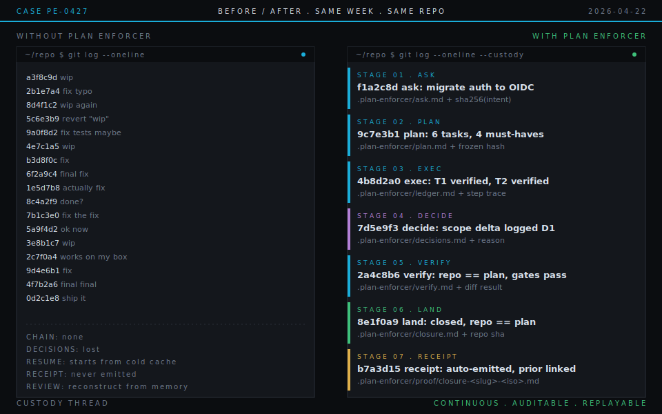
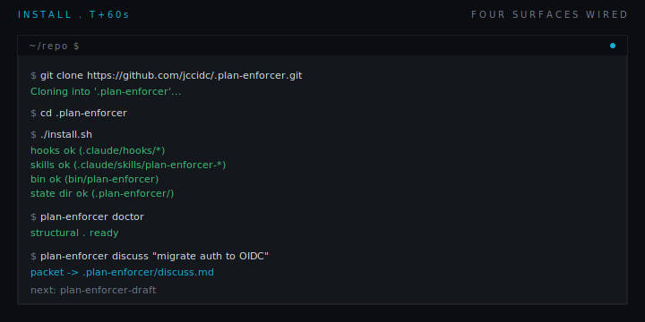
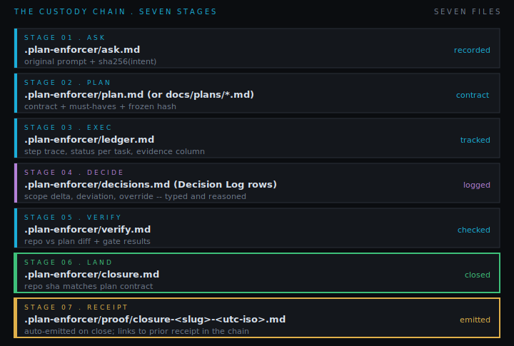
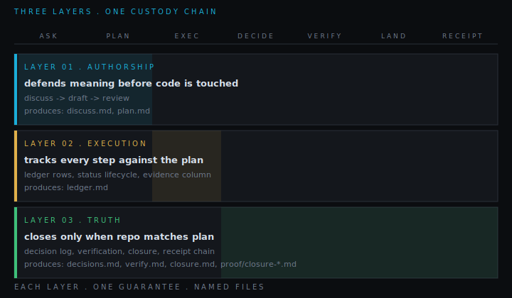
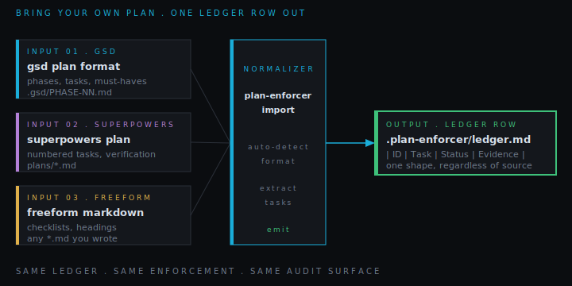
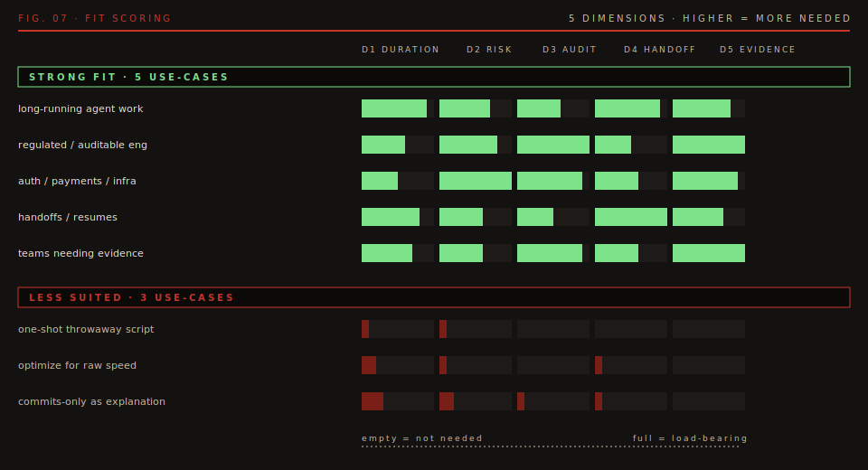

# Plan Enforcer

[](LICENSE)
[](https://claude.ai/code)
[](https://nodejs.org)

`CHAIN-OF-CUSTODY LAYER` `V0.1` `MIT`

Plan Enforcer is the ledger, decision trail, and chain of custody underneath AI-assisted coding -- from the original ask to the repo state that shipped. It runs as Claude Code hooks and skills, writes everything to a few named files in your repo, and intervenes when the agent tries to skip a step, drop a decision, or claim work is done before the repo agrees.



> Two git logs from the same week of work, same repo. On the left, wip-fix-revert is the entire story; nothing points back to an original ask, nothing names a decision. On the right, every commit carries the stage it belongs to and every stage points at a file you can open. Same effort, different chain of custody.

---

## 01 / Install

Sixty seconds. One ledger. Requires [Claude Code](https://claude.ai/code) and [Node.js >= 18](https://nodejs.org).

```bash
git clone https://github.com/jccidc/.plan-enforcer.git
cd .plan-enforcer
./install.sh
plan-enforcer doctor
plan-enforcer discuss "..."
```

`install.sh` wires four surfaces into the repo and writes nothing outside of it: the Claude Code hooks, the Plan Enforcer skill set, the `plan-enforcer` CLI, and a state directory at `.plan-enforcer/`. If `doctor` reports missing project config, that is onboarding state -- not a broken install. The first `discuss` or `import` bootstraps the rest.



> The four `ok` lines are the entire installation footprint. Nothing runs in the background, nothing reaches outside the repo, and every byte that lands lives inside paths you can read.

---

## 02 / The Custody Chain

Plan Enforcer's job is to keep one continuous trail from the original ask to the repo state that shipped. That trail has six stages, and every stage produces a file. When the chain breaks -- when scope narrows silently, when a decision happens but is never written down, when a session resumes from cold context, when work is called done before the repo agrees -- you can point at exactly which file is missing or wrong.



> Read this top to bottom and the product story falls out. `ask.md` and `plan.md` defend meaning before code is touched. `ledger.md` tracks every step against that plan. `decisions.md` catches deviations under a typed schema. `verify.md` and `closure.md` are how you can tell the work actually closed.

---

## 03 / Three Layers

The six-stage chain comes from three layers stacked beneath it. Authorship owns the move from raw ask to frozen plan. Execution owns the moment-to-moment fidelity of work against that plan. Truth owns the closing handshake -- decisions logged, repo state reconciled, closure receipt written. No layer can silently absorb another, which is what makes the chain survive an agent's drift.



> Authorship cannot claim execution's job; execution cannot skip the truth handshake. That separation is what an autonomous agent under context pressure cannot quietly collapse.

---

## 04 / Bring Your Own Plan

You don't need to write plans in any particular format. GSD phases, Superpowers plans, freeform `.md` checklists -- all of them feed `plan-enforcer import` and produce one normalized ledger entry. The format you pick is yours; the audited surface is ours.

```bash
plan-enforcer import docs/plans/my-plan.md
```



> The shape of the row at the right is what gets enforced. Whatever shape your team writes in lands in that shape, every time.

---

## 05 / Best Fit

Plan Enforcer earns its keep when the cost of losing a step is real. It is overhead for one-shot scripting and throwaway prototyping. It is load-bearing when work runs long, when the repo is regulated, when handoffs are routine, and when "done" needs to be defensible to someone who wasn't in the room.



> Read your project against the five bars. Empty bars mean you would be installing a custody layer you do not need. Filled bars mean you are already paying that cost somewhere -- usually scattered across commit messages, Slack threads, and reconstructed memory.

**Strong fit**

- long-running agent work where drift compounds over time
- regulated or auditable engineering
- migrations, auth, payments, infrastructure changes
- workflows with handoffs, resumes, and late requirement mutation
- teams that need evidence, not just output

**Less suited**

- one-shot throwaway scripting where audit does not matter
- workflows optimized purely for raw speed
- teams fine with commit messages as their only explanation layer

---

## 06 / Claim, Stated Narrowly

Not better prompting. Not a generative agent. Not a plan-writer. Plan Enforcer is the chain of custody underneath whatever generative process you already use -- the layer that keeps an AI implementation honest when it has to survive scrutiny, mutation, interruption, and final review.

> When AI-assisted implementation has to hold up to those four pressures, Plan Enforcer is what holds it.

---

## Proof and Provenance

The proof pack documents how Plan Enforcer behaves on real work in this repo:

- [Public proof map](docs/proof/public-proof.md)
- [Proof pack index](docs/proof/README.md)
- [Benchmark summary](docs/proof/benchmark-summary.md)
- [Carryover proof](docs/proof/carryover-proof.md)
- [Composability proof](docs/proof/composability-proof.md)
- [Dogfood proof](docs/proof/dogfood-proof.md)
- [Roadmap regression](docs/proof/roadmap-regression.md)

Open issues and pull requests are welcome. If your workflow has a real failure mode the proof pack does not surface yet, open an issue with receipts.

MIT. See [LICENSE](LICENSE).
